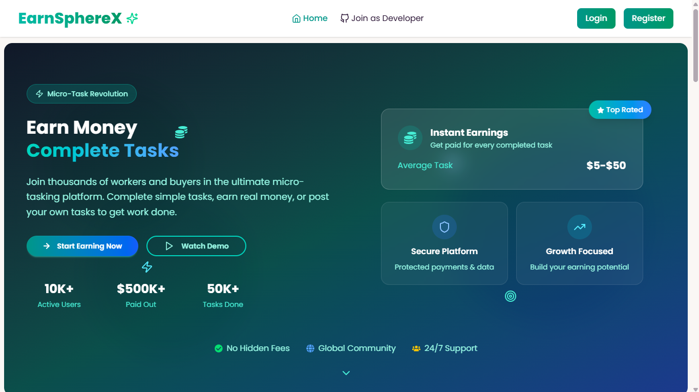

# EarnSphereX - Micro-Task Platform



## 🌟 Overview
EarnSphereX is a innovative micro-task platform that connects businesses with skilled workers to complete small tasks efficiently. The platform features a three-tier role system (Worker, Buyer, Admin) with specialized dashboards and functionalities.

## 🔗 Live Demo
[](https://earnspherex.web.app)

## 🏆 Key Features

### 👨‍💻 Worker Features
- Browse and claim available micro-tasks
- Submit completed work for review
- Track earnings and approved submissions
- Request withdrawals to cash out earnings
- View task history and performance metrics

### 🛒 Buyer Features
- Create and publish micro-tasks
- Set task requirements and rewards
- Review and approve worker submissions
- Manage task budgets with coin system
- Track task completion statistics

### 👑 Admin Features
- Comprehensive user management
- Oversee all platform transactions
- Process withdrawal requests
- Monitor platform health and metrics
- Resolve disputes and issues

## 🛠️ Technical Stack

### Frontend
- **Framework**: React 19 + Vite
- **State Management**: React Query
- **UI Library**: Tailwind CSS + DaisyUI
- **Authentication**: Firebase
- **Payments**: Stripe
- **Image Upload**: Cloudinary
- **Charts**: Recharts
- **Animations**: Framer Motion

### Backend
- **Runtime**: Node.js
- **Framework**: Express.js
- **Database**: MongoDB
- **Hosting**: Vercel
- **API**: RESTful architecture

## 🚀 Getting Started

### Prerequisites
- Node.js (v18 or higher)
- npm or yarn
- Firebase account
- Stripe account
- Cloudinary account

### Installation
1. Clone the repository:
   ```bash
   git clone https://github.com/yourusername/earnspherex-client.git
   cd earnspherex-client
   ```

2. Install dependencies:
   ```bash
   npm install
   ```

3. Create a `.env` file with your environment variables:
   ```env
   VITE_API_URL=https://earn-sphere-x-server.vercel.app
   VITE_FIREBASE_API_KEY=your_firebase_api_key
   VITE_FIREBASE_AUTH_DOMAIN=your_project.firebaseapp.com
   VITE_FIREBASE_PROJECT_ID=your_project_id
   VITE_FIREBASE_STORAGE_BUCKET=your_bucket.appspot.com
   VITE_FIREBASE_MESSAGING_SENDER_ID=your_sender_id
   VITE_FIREBASE_APP_ID=your_app_id
   VITE_payment_key=your_stripe_publishable_key
   VITE_cloud_name=your_cloudinary_name
   VITE_upload_preset=your_upload_preset
   ```

4. Start the development server:
   ```bash
   npm run dev
   ```

### Building for Production
```bash
npm run build
```

## 📂 Project Structure
```
earnspherex-client/
├── src/
│   ├── assets/            # Static assets
│   ├── components/        # Reusable UI components
│   ├── context/           # React context providers
│   ├── hooks/             # Custom React hooks
│   ├── pages/             # Page components
│   │   ├── Auth/          # Authentication pages
│   │   ├── Buyer/         # Buyer dashboard pages
│   │   ├── Worker/        # Worker dashboard pages
│   │   ├── Admin/         # Admin dashboard pages
│   │   └── Home/          # Public pages
│   ├── services/          # API service layer
│   ├── utils/             # Utility functions
│   ├── App.jsx            # Main application component
│   └── main.jsx           # Application entry point
├── public/                # Public assets
├── .env.example           # Environment variables template
├── vite.config.js         # Vite configuration
└── tailwind.config.js     # Tailwind CSS configuration
```

## 🔒 Security Features
- Role-based authentication with Firebase
- Secure API endpoints with JWT verification
- Protected routes for all dashboards
- Input validation on all forms
- Encrypted sensitive data
- Rate limiting on API endpoints
- CORS policy enforcement

## 🌐 Deployment

### Frontend Deployment (Firebase Hosting)
1. Install Firebase CLI:
   ```bash
   npm install -g firebase-tools
   ```

2. Login to Firebase:
   ```bash
   firebase login
   ```

3. Initialize Firebase project:
   ```bash
   firebase init hosting
   ```

4. Deploy to Firebase:
   ```bash
   npm run build
   firebase deploy
   ```

### Backend Deployment (Vercel)
1. Install Vercel CLI:
   ```bash
   npm install -g vercel
   ```

2. Login to Vercel:
   ```bash
   vercel login
   ```

3. Deploy:
   ```bash
   vercel
   ```

## 📝 Documentation
- [API Documentation](https://earn-sphere-x-server.vercel.app/api-docs)
- [Firebase Setup Guide](https://firebase.google.com/docs)
- [Stripe Integration Docs](https://stripe.com/docs)

## 🤝 Contributing
We welcome contributions! Please follow these steps:
1. Fork the repository
2. Create your feature branch (`git checkout -b feature/AmazingFeature`)
3. Commit your changes (`git commit -m 'Add some AmazingFeature'`)
4. Push to the branch (`git push origin feature/AmazingFeature`)
5. Open a Pull Request

## 📄 License
This project is licensed under the MIT License - see the [LICENSE](LICENSE) file for details.

## 🙏 Acknowledgments
- Firebase team for authentication services
- Stripe for payment processing
- Cloudinary for image management
- Vercel for hosting
- All open-source contributors
